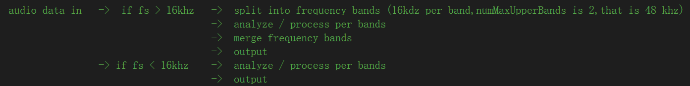

#  WebRtc noise suppression

This project is a standalone noise suppression module which reference from google's official webrtc project. I rewraped it so that it can be used in other places. The files used in this project in sync with  official webrtc project respository. (branch de10eea, 2018.12).

**TODO List:**			

- [x] noise suppression in hight sample rate	- DONE supproted 32khz and 48 khz.
- [ ] Explaining the principle of Webrtc's noise suppression algorithm.  - TODO

The noise suppression process flow can be summed up as below:

WebRtc uses AudioBuffer class to split audio date into different bands.	I have capture the main splitting filter function in order to support 32khz and 48khz.

For more details, please find https://chromium.googlesource.com/external/webrtc/+/master  and the codes.

------

## Test cases 

input :

assets\babble_15dB.wav

output:

ns_level = kLow    	||	webrtc_ns_kLow_babble_15dB.wav
ns_level = kModerate	||	webrtc_ns_kModerate_babble_15dB.wav
ns_level = kHigh		||	webrtc_ns_kHigh_babble_15dB.wav

The rnnoise and speexdsp's noise suppression test case wav files are captured from the https://people.xiph.rog/~jm/demo/rnnoise/

Thses files can be found in the link [TEST_CASES](https://github.com/jagger2048/WebRtc_noise_suppression/assets/test_case)

## Performance

With the same input,babble_15dB.wav, we set up a contrast among RNNoise, speexdsp and webrtc_ns.In the listening test, RNNoise performs well and suppresses the noise in babble.. It introduces a bit of artifacts which sounds unnature but it is tolerable. 

For the webrtc's ns, kHigh performs better than kModerate  which can suppress the whole noise.The kLow case has a poor performance than the others. Notes that the webrtc's ns has an impacts of the Gain when processed the audio data, maybe it should be interfaced with AGC module. 

Finally, speexdsp's ns can suppress the babble noise but  not completely reduce the backgourd noise. These noise suppression algorithm's performance can be summed up  as blows:
$$
kLow   < speechx \approx kModerate <kHigh \approx Rnnoise
$$

## Update history:

[中文说明-for ver0.1](https://github.com/jagger2048/WebRtc_noise_suppression/readme_cn.md)

-  ver 1.0			2018-12-6
- [x] 1. Update the dependent files in sync with official webrtc project (branch de10eea, 2018.12).
- [x] 2. Wraped noise suppression interface and support 32khz,48khz sample rete.
- [x] 3. Mono supported.Stereo supported can be modify easily.
- ver 0.1			2018-7
- [x] 1. Capture the code of noise suppression module in webrtc project.
- [x] 2. A simple implement of noise suppression alorithm,supported 8khz and 16khz.
