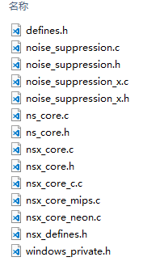
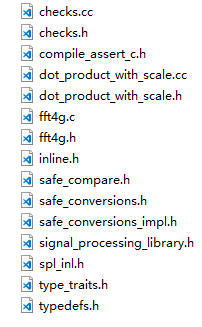

# WebRtc Noise suppression

本文将会介绍如何使用 google 的 webtrc 项目中的 noise suppression 模块。该模块可以对输入的音频信号进行降噪处理，并输出降噪后的信号，从时域图来看有点类似于 noise gate，从效果上来看降噪后的信号频谱图变化不大，但是实际听感会有点干，总体而言效果还是不错的。

需要注意的是，webrtc 中的 noise suppression 算法是针对于语音信号设计的，如果直接应用在音乐信号上效果会有所折扣（后续的测试也验证了这一点），并且对于输入信号的采样率有一定的要求，不能大于32k（大于32k需要 resample），因此本文仅就如何从 webrtc 项目中提取 noise suppression 模块以及如何使用该模块进行讲解，如何应用需要根据实际的需求进行取舍。

## 背景介绍

WebRtc，*web real-time communication*，是由谷歌创立并开源的为浏览器、手机应用提供简单而又高效的实时通信解决方案的项目，该项目同时包含视频处理、音频处理、网络交互等模块，主要在浏览器中应用。Noise suppression ，为音频处理模块下的一个子项，音频处理模块（APM，*audio processing module*）下还有 AGC、AEC 、VAD等子模块。

在开源领域，还有另一个项目 Speex 也提供了类似于 webrtc 的全套音频解决方案，该项目的商业化项目为 Opus。除了使用传统的音频处理的方式降噪之外，还有一些使用更为现代的方式进行降噪，RNNoise 项目就是基于 RNN 神经网络实现对噪声的滤除，并且由于该方法的特性，可适用于全频带降噪（音乐信号），因此应用场景会更广。

以上提及的项目可以从以下链接中找到更详细的介绍：

https://webrtc.org

https://www.speex.org

https://people.xiph.org/~jm/demo/rnnoise/

本文将会介绍如何提取 WebRtc 中的 noise suppression 模块。

## 程序框架及过程

首先，到官方程序库下载 noise suppression 需要用到的文件：

https://chromium.googlesource.com/external/webrtc/stable/webrtc/+/master/modules/audio_processing

在 module/audio_processing/ns 下获取以下文件：



在 webrtc-refs_heads_master-**rtc_base** 中也有一些补充的文件，根据程序依赖在程序库中自行搜索下载：



 需要**注意**的是，提取出来的文件要**修改**对应的 #include 选项才可以正常使用

接下来进入正题，了解 noise suppression 模块的程序流程，并以此重新构建自己的处理模块。

## 处理流程

WebRtc noisesuppression 模块的处理流程主要是按照以下来进行：

​		开始->初始化->设置处理模式->帧处理->释放句柄->结束

具体的步骤如下：

- 初始化句柄

  ```c++
  NsHandle *nsHandle = WebRtcNs_Create();
  int status = WebRtcNs_Init(nsHandle, sample_rate);
  ```

  其中初始化成功则 **status**  返回 0

- 设置处理模式

  ```c++
  status = WebRtcNs_set_policy(nsHandle, kVeryHigh);
  ```

  **kVeryHigh** 为降噪的等级，取值 0~3 ，对应降噪等级从低到高，根据实际应用选择，本文选择2。**status**    设置成功返回 0 

- 帧处理

  - 分帧输入

    ```c++
    float inf_buffer[maxSamples];
    float outf_buffer[maxSamples];
    //  input the signal to process
    for (int n = 0; n != samples; ++n) {
        inf_buffer[n] = input[0][samples * i + n];	// 后续考虑使用其他方式
    }
    ...
    ```

    从输入信号中，取 10ms 的信号，16k的采样率也就是160点，8khz 则是 80 点。webRtc的函数最多只能处理160点，对大于16k的输入信号，需要降采样输入处理

    ps：此处存疑，按照查阅的资料，内置函数最高可以处理 32k 的信号，不过需要进行分频后按照不同的频带进行输入（由于内置的分频函数需要用到Q16定点数，因此不推荐使用分频法处理高采样率的信号），因此对大于16k的信号，可以直接降采样为16k进行处理，也可以降采样为32k，然后分频段输入处理。为简单起见直接降采样处理。

  - 噪声分析

    ```c++
    float *nsIn[1] = { inf_buffer }; //ns input[band][data]
    float *nsOut[1] = { outf_buffer };//ns output[band][data]
    WebRtcNs_Analyze(nsHandle, nsIn[0]);
    ```

    调用用函数进行处理，注意输入待处理的数据

  - 降噪处理

    ```c++
    WebRtcNs_Process(nsHandle, (const float *const *)nsIn, num_bands, nsOut);
    
    ```

    对输入信号进行降噪，函数中 num_bands 参数（取值1~2）对应着分频带之后的频段，对于16khz 的输入信号来讲可以可以不用管，鉴于我们直接使用降采样的方式处理高采样率的信号，因此该参数可以设置为 1

  - 按帧输出

    ```c++
    // output the processed signal
    for (int n = 0; n != samples; ++n) {
    output[0].push_back(nsOut[0][n]);	// test 
    }
    ```

    按帧输出信号

- 释放句柄

  ```c++
  	WebRtcNs_Free(nsHandle);
  ```

对应的例程可以在 webRtc_official 中找到，后续我们会补充处理 16khz 采样率以上的音频信号的例程【直接使用降采样将高采样率的信号降成16k的信号，然后降噪输出，输出的分辨率视情况而定，指定/不变】

ps：

1. 由于分频法在最新的文件依赖中有所改动，并且还需要将原有浮点数转成定点格式才能处理，因此不再尝试用该方法处理高采样率下的情况
2. 对于音乐信号，经过本算法处理后虽然也有降噪效果，但实际听感会有点不自然，因此不推荐对音乐信号降噪时使用本算法，推荐用于语音信号的降噪。
3. 在经过降噪后，会使信号增益下降，实际应用中需考虑增加 AGC，*Auto gain control*， 模块
